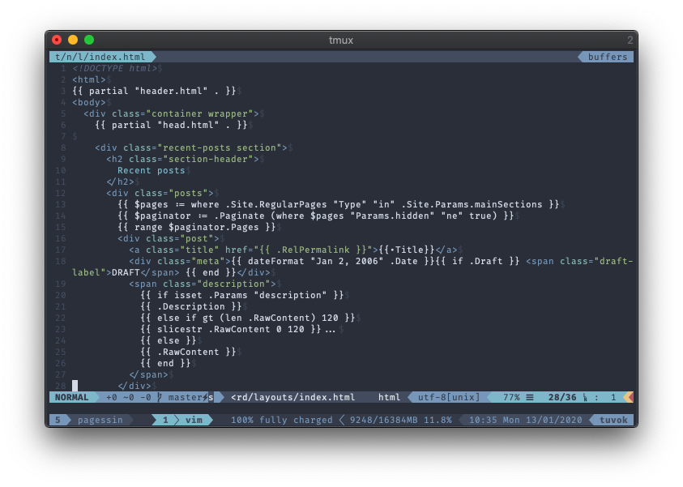

It’s the holy grail of terminal styling, the goal that keeps you ging fiddling
with your setup until you get it right. Well maybe it isn’t but it took me a
while to pull of. 

I’m talking about getting full GUI color support all the way from your terminal
emulator (iTerm in my case), through tmux and into him. And it should work via
SSH too while you’re at it. 

## Terminal emulator

First you need to set you’re terminal emulator up to at the `$TERM` environment
variable to something that tells programs the emulator is able to shows colors.
In iTerm you can configure this in the settings like in the screenshot here:


Set it to something like `xterm-256colors`. **Do not set `$TERM` in your
`.bashrc`** or equivalent, as you might read on some answers on StackOverflow.
It’s the terminal emulator’s job to communicate it’s capabilities.

At this point, you can already check if the step works. Here’s a short bash
script that I grabbed from a [StackOverflow answer](https://stackoverflow.com/a/53343481):

```bash
#!/bin/bash
awk -v term_cols="${width:-$(tput cols || echo 80)}" 'BEGIN{
    s="/\\";
    for (colnum = 0; colnum<term_cols; colnum++) {
        r = 255-(colnum*255/term_cols);
        g = (colnum*510/term_cols);
        b = (colnum*255/term_cols);
        if (g>255) g = 510-g;
        printf "\033[48;2;%d;%d;%dm", r,g,b;
        printf "\033[38;2;%d;%d;%dm", 255-r,255-g,255-b;
        printf "%s\033[0m", substr(s,colnum%2+1,1);
    }
    printf "\n";
}'
```

If the configuration is correct, you will see a smooth rainbow like in the
picture below:


If it didn’t, you will see obvious jumps in the colors. If that’s the case, you
might want to make sure you didn’t mistype, or try a different terminal
emulator. 

## tmux

Step two is tmux. For this you’ll need to add two lines to your `.tmux.conf`
file like this:

```
# This is what TERM will be inside the tmux session
set-option -g default-terminal "tmux-256color"
# This tells tmux to enable full colors if TERM outside is xterm-256color
set-option -g terminal-overrides ",xterm-256color:RGB"
```

Some spots online have the first line read `screen-256color`. The screen here
refers to the program *screen*, which tmux used to emulate here. By now, tmux
supports it’s own key, and I believe programs further down check for it to
optionally support things like italic fonts. 

By default, there won't be a *terminfo* for `tmux-256color`. [Terminfo](https://en.wikipedia.org/wiki/Terminfo) is a (very
old) system to describe terminal capabilities to programs. Programs can use it
to figure out which control sequences to send in order to achieve things like
moving the cursor, or, you know, displaying colors! Essentially, `$TERM` from
above tells programs which terminfo entry to load.

Fortunately, you can add a terminfo entry by using this file:

```bash
# You might want to verify this file does what it says on the tin, just to be safe
wget http://invisible-island.net/datafiles/current/terminfo.src.gz
gunzip terminfo.src.gz
tic /tmp/terminfo.src
```


You can now launch a tmux session and use the script from above to see if you
see the continuous colors inside it. Note that the whole server seems to need a
restart for these settings to be applied correctly. You might also want to
verify that `$TERM` is indeed what it should be with `echo $TERM`. 

## Vim

Finally, you’ll want to add these lines to your `.vimrc` so that vim actually
starts sending the color escape codes in the first place:

```vim
let &t_8f = "\<Esc>[38;2;%lu;%lu;%lum"
let &t_8b = "\<Esc>[48;2;%lu;%lu;%lum"
set termguicolors
```

Now you’ll obviously need a color scheme that supports these colors so that
though see them. One such theme would be
[Nord](https://github.com/arcticicestudio/nord-vim). They also have colors for
iTerm [here](https://github.com/arcticicestudio/nord-iterm2). You can also
configure the Nord vim theme so that it prints comments in *italics* like this:

```vim
let g:nord_italic = 1
let g:nord_italic_comments = 1
```
And this is what it looks like for me in the end:


